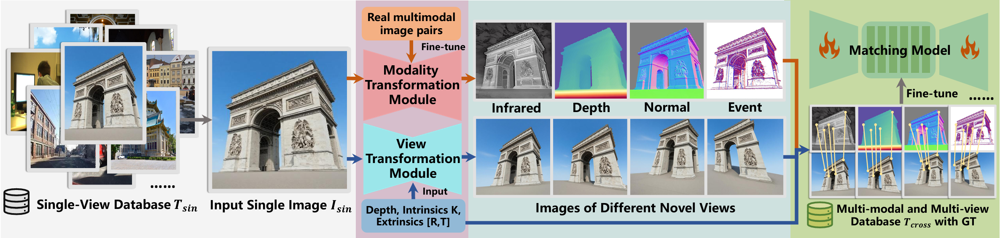

<div align="center">
<h1>AnyMatch: Supercharging Universal Multi-Modal Image Matching with Large-Scale Single-View Images</h1>

<a href="https://arxiv.org/abs/2606.31077" target="_blank" rel="noopener noreferrer">
  
</a>
<a href="extension://bfdogplmndidlpjfhoijckpakkdjkkil/pdf/viewer.html?file=https%3A%2F%2Farxiv.org%2Fpdf%2F2606.31077" target="_blank">
  
</a>
<a href="https://github.com/MnYangs/AnyMatch" target="_blank">
  
</a>
<a href="https://github.com/MnYangs/AnyMatch" target="_blank"></a>

[Meng Yang](https://github.com/MnYangs)<sup>1*</sup> &nbsp;
[Zizhuo Li](https://github.com/ZizhuoLi)<sup>1*</sup><sup>&dagger;</sup> &nbsp;
[Linfeng Tang](https://github.com/Linfeng-Tang)<sup>2</sup> &nbsp;
[Fan Fan](https://orcid.org/0000-0002-7507-1810)<sup>2&#9993;</sup> &nbsp;
<br>
[Jiayi Ma](https://github.com/jiayi-ma)<sup>2</sup> &nbsp;
<br> 

<sup>1</sup>Electronic Information School, Wuhan University, Wuhan 430072, China &emsp; <sup>2</sup>School of Robotics, Wuhan University, Wuhan 430072, China &emsp;
<br>
<sup>*</sup> Equal Contribution &emsp; <sup>&dagger;</sup> Project leader &emsp; <sup>&#9993;</sup> Corresponding Authors
<br>
{2024102120059, zizhuo\_li, fanfan}@whu.edu.cn, {linfeng0419, jyma2010}@gmail.com<br>
</div>

## 🌀 Overview

<p align="center">
  
  <br>
  <em>AnyMatch synthesizes large-scale multi-modal pairs (RGB-IR/Depth/Normal/Event) from single-view images with 3D consistency via depth estimation, reprojection, inpainting, and cross-modal translation. Fine-tuning LoFTR/EDM/RoMa on Any-syn achieves SOTA cross-modal matching and zero-shot generalization.</em>
</p>

## 📰 News
- **[2026-06-30]** ULF-Loc paper is available on [arXiv](https://arxiv.org/abs/2605.04730).🎉
- **[2026-06-18]** Our paper is accepted by ECCV 2026! 🌟


## 📖 Citation

If you find our work or code useful, please consider citing our paper:

```bibtex
@misc{yang2026anymatchsupercharginguniversalmultimodal,
      title={AnyMatch: Supercharging Universal Multi-Modal Image Matching with Large-Scale Single-View Images}, 
      author={Meng Yang and Zizhuo Li and Linfeng Tang and Fan Fan and Jiayi Ma},
      year={2026},
      eprint={2606.31077},
      archivePrefix={arXiv},
      primaryClass={cs.CV},
      url={https://arxiv.org/abs/2606.31077}, 
}
```
