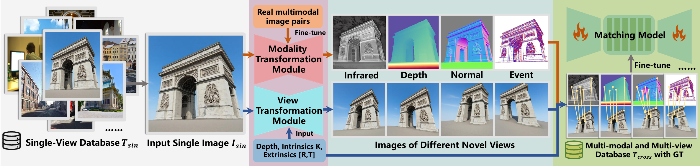
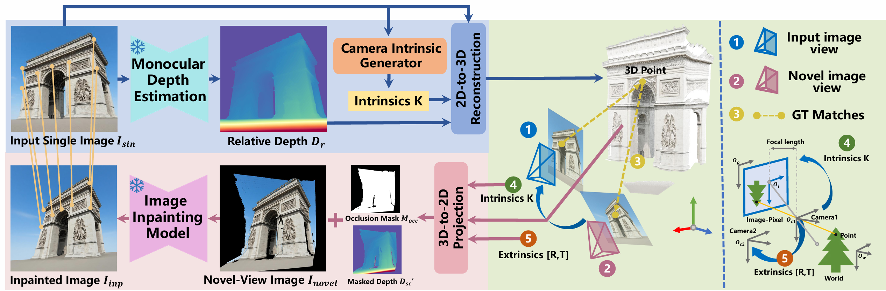
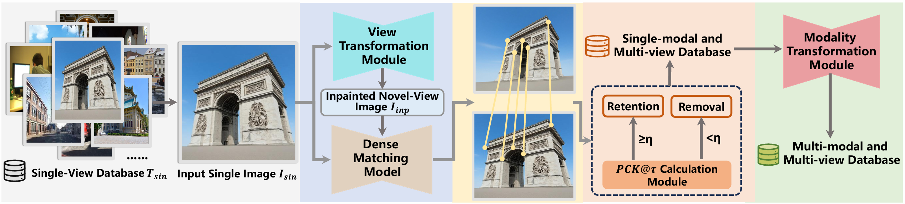
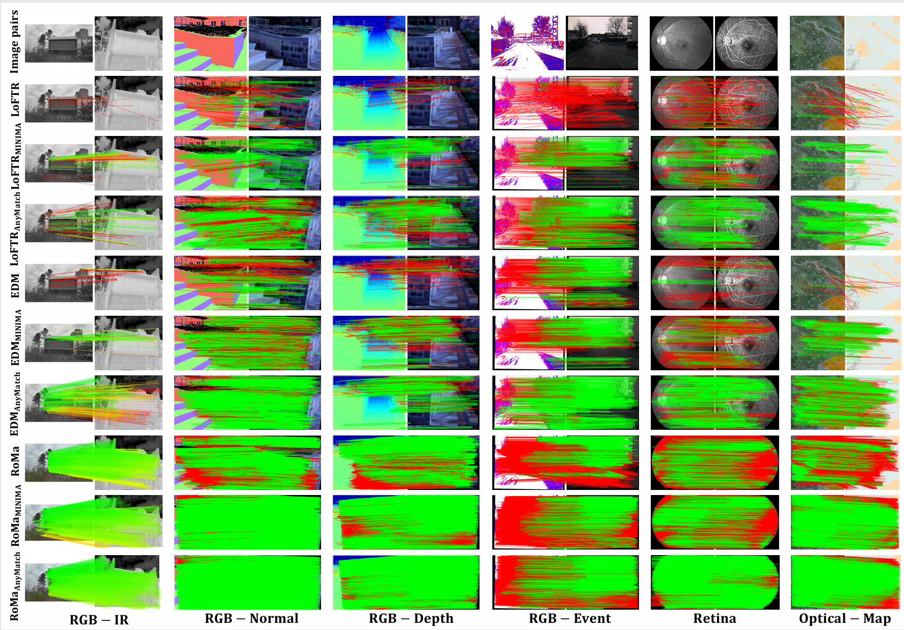

<div align="center">
<h1>ECCV 2026 AnyMatch: Supercharging Universal Multi-Modal Image Matching with Large-Scale Single-View Images</h1>

<a href="https://arxiv.org/abs/2606.31077" target="_blank" rel="noopener noreferrer">
  
</a>
<a href="extension://bfdogplmndidlpjfhoijckpakkdjkkil/pdf/viewer.html?file=https%3A%2F%2Farxiv.org%2Fpdf%2F2606.31077" target="_blank">
  
</a>
<a href="https://github.com/MnYangs/AnyMatch" target="_blank">
  
</a>
<a href="https://github.com/MnYangs/AnyMatch" target="_blank"></a>

[Meng Yang](https://github.com/MnYangs)<sup>1*</sup> &nbsp;
[Zizhuo Li](https://github.com/ZizhuoLi)<sup>1*</sup><sup>&dagger;</sup> &nbsp;
[Linfeng Tang](https://github.com/Linfeng-Tang)<sup>2</sup> &nbsp;
[Fan Fan](https://orcid.org/0000-0002-7507-1810)<sup>2&#9993;</sup> &nbsp;
<br>
[Jiayi Ma](https://github.com/jiayi-ma)<sup>2</sup> &nbsp;
<br> 

<sup>1</sup>Electronic Information School, Wuhan University, Wuhan 430072, China &emsp; <sup>2</sup>School of Robotics, Wuhan University, Wuhan 430072, China &emsp;
<br>
<sup>*</sup> Equal Contribution &emsp; <sup>&dagger;</sup> Project leader &emsp; <sup>&#9993;</sup> Corresponding Author
<br>
{2024102120059, zizhuo\_li, fanfan}@whu.edu.cn, {linfeng0419, jyma2010}@gmail.com<br>
</div>

## 🌀 Overview

<p align="center">
  
  <br>
  <em>AnyMatch synthesizes large-scale multi-modal pairs (RGB-IR/Depth/Normal/Event) from single-view images with 3D consistency via depth estimation, reprojection, inpainting, and cross-modal translation. Fine-tuning LoFTR/EDM/RoMa on Any-syn achieves SOTA cross-modal matching and zero-shot generalization.</em>
</p>

## 🌀 View Transformation
<p align="center">
  
  <br>
</p>

The View Transformation module lifts a single 2D image into 3D space via monocular depth estimation and reprojects it to novel views with inpainting, generating geometrically consistent multi-view image pairs without relying on SfM-MVS.

**Start View Transformation**. Please run：

```bash
python ./View_Transformation/NovelViewTransformation.py
```
Refer to <a href="https://github.com/MnYangs/AnyMatch/tree/main/View_Transformation/readme.md">View Transformation</a> for details.

## 🌀 Modality Transformation
The Modality Transformation module converts the original single-view visible image into multiple target modalities (infrared, depth, normal, and event) using dedicated cross-modal translation models (e.g., RGB-to-IR diffusion, monocular depth/normal estimators, and motion-based event synthesis), thereby generating diverse multi-modal image pairs that simulate real-world sensor differences.

**Start Modality Transformation**. Please run：
RGB to IR:
```bash
python ./Modality_Transformation/RGB2IR/rgb2ir.py
```
RGB to depth:
```bash
python ./Modality_Transformation/RGB2depth/rgb2depth.py
```
RGB to normal:
```bash
python ./Modality_Transformation/RGB2normal/rgb2normal.py
```
RGB to event:
```bash
python ./Modality_Transformation/RGB2normal/rgb2event.py
```
RGB to other:
```bash
python ./Modality_Transformation/RGB2other/....py
```
Refer to <a href="https://github.com/MnYangs/AnyMatch/tree/main/Modality_Transformation/readme.md">Modality Transformation</a> for details.

## 🌀 SGCV module
<p align="center">
  
  <br>
</p>

The **SGCV** module is a quality‑control step in the AnyMatch pipeline. After generating a novel‑view image pair, it uses a pretrained dense matching model (RoMa) to compute the **Percentage of Correct Keypoints (PCK)** at a threshold `τ` between the rendered correspondence and the ground‑truth geometric projection.
```bash
python ./SGVC/SGVC_pck.py
```
Refer to <a href="https://github.com/MnYangs/AnyMatch/blob/main/SGVC/readme.md">SGCV</a> for details.

## ✨ With the View Transformation and Modality Transformation modules, you can create multi‑modal matching datasets tailored to your own domain! ✨
<p align="center">
  
  <br>
</p>
<p align="center">
  
  <br>
</p>

## 🌀 Single-View Database Preparation
The Single-View Database in AnyMatch is a large-scale collection of real-world RGB images sourced from public datasets (GLDv2 and SA-1B), all uniformly resized and center-cropped to 512×512 resolution. This database serves as the fundamental input repository, replacing expensive multi-view or multi-sensor acquisitions, and provides diverse, high-quality single-view images that are subsequently transformed by the View and Modality Transformation modules to generate geometrically consistent multi-modal training data with broad scene coverage.
### Single-View Database for Any-syn test subset 
Please refer to <a href="https://github.com/MnYangs/AnyMatch/blob/main/data/%20Single-View-Data/readme-SA-1B.md">SA-1B Dataset</a> for details.

### Single-View Database for Any-syn train subset 
Please refer to <a href="https://github.com/MnYangs/AnyMatch/blob/main/data/%20Single-View-Data/readme-GLDv2.md">GLDv2 Dataset</a> for details.


## 🌀 Data Preparation for Evaluation
We are grateful to the authors for their contribution of the testing datasets of the real multimodal scenarios.

<p></p> <details> <summary><b> METU_VisTIR Test Dataset </b></summary>  
Please refer to <a href="https://github.com/MnYangs/AnyMatch/blob/main/data/RealDataset/METU_VisTIR/README.md">METU_VisTIR</a> for details.
</details>
<p></p>

<p></p> <details> <summary><b> MMIM Test Dataset </b></summary>  
Please refer to <a href="https://github.com/MnYangs/AnyMatch/blob/main/data/RealDataset/MMIM/readme.md">MMIM</a> for details.
</details>
<p></p>

<p></p> <details> <summary><b> RGB-Depth Test Dataset </b></summary>  
Please refer to <a href="https://github.com/MnYangs/AnyMatch/blob/main/data/RealDataset/RGB-Depth/readme.md">RGB-Depth</a> for details.
</details>
<p></p>

<p></p> <details> <summary><b> RGB-EVENT Test Dataset </b></summary>  
Please refer to <a href="https://github.com/MnYangs/AnyMatch/blob/main/data/RealDataset/RGB-EVENT/readme.md">RGB-EVENT</a> for details.
</details>
<p></p>

<p></p> <details> <summary><b> RGB-Normal Test Dataset </b></summary>  
Please refer to <a href="https://github.com/MnYangs/AnyMatch/blob/main/data/RealDataset/RGB-Normal/readme.md">RGB-Normal</a> for details.
</details>
<p></p>

### Data Structure

<p></p> <details> <summary><b>Organizing the Dataset</b></summary>     

We recommend organizing the datasets in the following folder structure:

```
data/
├── test_data_preparation.sh          
│
├── Any-syn-test/                     
│
├── Single-View-Data/                 
│   ├── 01_HouseIndoor.jpg
│   ├── 02_Office.jpg
│   ├── 03_Traffic.jpg
│   ├── 05_Mountain.jpg
│   ├── 06_MaitreyaBuddha.png
│   ├── 07_Breads.jpg
│   ├── 08_CatGirl.png
│   ├── 09_Restaurant.jpg
│   ├── readme-GLDv2.md
│   └── readme-SA-1B.md
│
├── RealDataset/                     
│   │
│   ├── METU_VisTIR/                  
│   │   ├── index/                    
│   │   ├── cloudy/                   
│   │   └── sunny/                 
│   │       └── ...
│   │
│   ├── MMIM/                        
│   │   └── RemoteSensing/
│   │   └── Medical/
│   │   └── ComputerVision/
│   │   └── test_list_2.txt
│   │   └── test_list.txt
│   │       
│   │
│   ├── RGB-Depth/                   
│   │   └── val/
│   │   └── val_outdoor.csv
│   │
│   ├── RGB-EVENT/                   
│   │   └── DSEC/
│   │       ├── vent_list.txt       
│   │       ├── thun_01_a/            
│   │       └── interlaken_00_c/
│   │       └── city_02_a/            
│   │
│   └── RGB-Normal/                
│   │   └── val/
│   │   └── val_outdoor.csv
```
</details>
<p></p>

## 🌀 Multimodal Image Matching Evaluation
We provide the multi-modality image matching benchmark commands for our AnyMatch models.
Choose the method from `loftr`, `EDM`, and `roma` for the multimodal evaluation.
<p align="center">
  
  <br>
</p>
### Test on Real Multimodal Datasets

```bash
python test_relative_pose_infrared.py  # Infrared-RGB

python test_relative_homo_depth.py     # Depth-RGB

python test_relative_homo_event.py     # Event-RGB

# --choose_model: 0 for medical test, 1 for remote sensing test
python test_relative_homo_mmim.py    
```

### Test on Any-syn Dataset

```bash
python test_relative_pose_Any_syn.py 
# --modality: Choose from [infrared, depth, event, normal]
```

Note: By default, the checkpoint is initialized from the MINIMA models in the `weights` folder, and you can specify a
custom checkpoint using the `--ckpt` argument.

### Run demo code

```bash
python ./demo/demo_anymatch.py 
```

## 📰 News
- **[2026-07-28]** AnyMatch Data Engine (View Transformation and Modality Transformation) has been released.🎉
- **[2026-07-26]** AnyMatch test demo has been released.🎉
- **[2026-06-30]** AnyMatch paper is available on [arXiv](https://arxiv.org/abs/2605.04730).🎉
- **[2026-06-18]** Our paper is accepted by ECCV 2026! 🌟

## 📃TODO List

- [x] Test Demo
- [ ] Any-Syn Full Dataset
- [x] Real Multimodal Evaluation Benchmark
- [ ] Synthetic Multimodal Evaluation Benchmark
- [ ] Training Code
- [x] Our AnyMatch Data Engine for Multimodal Data Generation
- [ ] More Modalities Addition

## 📖 Citation

If you find our work or code useful, please consider citing our paper:

```bibtex
@misc{yang2026anymatchsupercharginguniversalmultimodal,
      title={AnyMatch: Supercharging Universal Multi-Modal Image Matching with Large-Scale Single-View Images}, 
      author={Meng Yang and Zizhuo Li and Linfeng Tang and Fan Fan and Jiayi Ma},
      year={2026},
      eprint={2606.31077},
      archivePrefix={arXiv},
      primaryClass={cs.CV},
      url={https://arxiv.org/abs/2606.31077}, 
}
```
